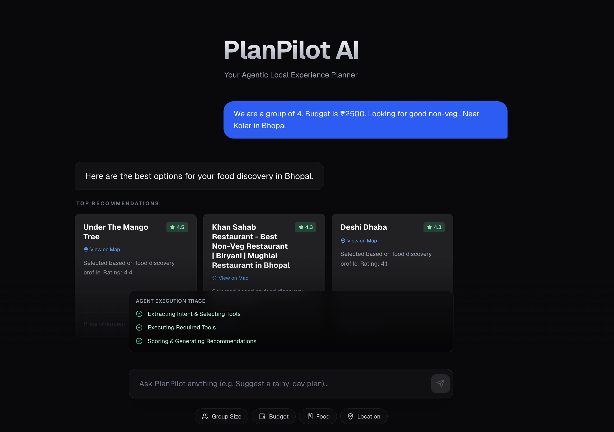

# PlanPilot AI 🗺️

**PlanPilot AI** is an intelligent, agentic local experience planner. It uses an autonomous LangGraph agent powered by LLM to understand your intent, pull real-time data from various APIs (Google Places, Tavily Events, OpenWeather), and apply dynamic, deterministic scoring to provide the perfect recommendations for dining, outings, and events.



## Features ✨

- **Intent-Aware AI**: Automatically understands if you're looking for a "rainy-day plan", a "budget-friendly dinner", or a "birthday celebration".
- **Dynamic Tool Execution**: Intelligently selects and calls only the necessary APIs (Weather, Google Places, Events) to answer your query.
- **Deterministic Scoring Engine**: Calculates recommendation scores dynamically based on your intent profile (e.g., heavily weighting weather for outdoor plans, or ratings for food discovery), ensuring explainable and reliable results.
- **Real-Time Data**: Integrates with Google Places API for locations, OpenWeatherMap for weather contexts, and Tavily for live local events.
- **Modern UI/UX**: Built with Next.js, TailwindCSS, and Framer Motion for a stunning, glassmorphic chat interface with micro-animations.
- **Agent Trace Visualization**: A live Tool Trace panel shows exactly what the LangGraph agent is doing under the hood.

## Architecture 🏗️

This project uses a hybrid architecture:
- **Frontend**: Next.js (App Router), React, TailwindCSS, Framer Motion, Lucide Icons.
- **Backend**: FastAPI, Python, LangGraph (`StateGraph`), Pydantic.
- **LLM**: Google Gemini (`gemini-2.5-flash`).

## Getting Started 🚀

### Prerequisites
Make sure you have Node.js and Python 3.10+ installed.

### 1. Environment Setup
Create a `.env` file in the root directory and add your API keys:
```env
GOOGLE_API_KEY=your_gemini_api_key
GOOGLE_PLACES_API_KEY=your_google_places_api_key
TAVILY_API_KEY=your_tavily_api_key
OPENWEATHERMAP_API_KEY=your_openweather_api_key
```

### 2. Backend Setup (FastAPI + LangGraph)
Initialize your Python virtual environment and install the dependencies:
```bash
python3 -m venv .venv
source .venv/bin/activate
pip install -r requirements.txt
```
Start the backend server (runs on `http://127.0.0.1:8000`):
```bash
uvicorn api.index:app --reload
```

### 3. Frontend Setup (Next.js)
In a new terminal window, install the NPM dependencies:
```bash
npm install
```
Start the Next.js development server (runs on `http://localhost:3000`):
```bash
npm run dev
```

Open [http://localhost:3000](http://localhost:3000) in your browser to start planning your experiences!

## Deployment 🌐
This project is configured to be deployed effortlessly on **Vercel**. 
The `vercel.json` and `next.config.mjs` files are already set up to route `/api/*` traffic to the FastAPI Serverless Functions.
